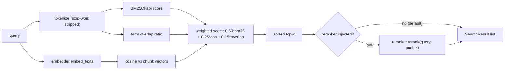

# design: retrieval

## Shape

## Modules

### `src/retrieval/ranker.py`

Defines `HybridRanker`, `SearchResult`, and the deterministic
`tokenize` helper. The ranker holds the tokenized corpus, the BM25
index, the chunk vectors, and the optional reranker.

### `src/retrieval/embedder.py`

Defines `HashingEmbedder` (the deterministic default) plus the
`EmbedderLike` protocol so an OpenAI-backed embedder can drop in
without ranker changes.

### `src/retrieval/index.py`

Defines `DocumentChunk`, the sample-corpus loader, and the optional
`build_chroma_collection` helper for developer-local full-corpus runs.

### `src/retrieval/reranker.py`

Defines the optional cross-encoder reranker (opt-in only). Lives in
the repo so future experiments on larger corpora can re-test the
ranker-vs-rerank tradeoff without rebuilding the integration.

### `src/retrieval/citations.py`

Defines `Citation` and the post-hoc verifier. Lives in the retrieval
package because verification reads from the same `DocumentChunk` shape
the ranker returns.

## Failure modes

- A query with zero overlap against any chunk returns a list of
  results scored at `0.03 * vector`, all near zero. The refusal layer
  (`src/agent/refusal.py`) catches this and abstains instead of
  returning a low-confidence answer.
- A reranker is injected but loads slowly or fails: the ranker still
  computes the deterministic top-k first, so the failure mode is a
  reranker-only error, not a retrieval blackout.
- The Chroma persistence path is hit in CI by accident: the helper
  imports `chromadb` lazily, and the default code paths never call
  the helper, so CI runs do not depend on Chroma being present.
