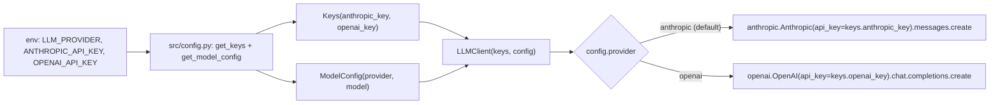

# design: llm-provider

## Shape

## Modules

### `src/agent/llm.py`

Defines `LLMClient`. Holds a `Keys` and a `ModelConfig`. Provides
`complete(messages, *, system, max_tokens)` and
`stream(messages, *, system, max_tokens)`. Dispatches on
`config.provider` to the matching SDK. The module-level docstring
names the no-env-read rule.

### `src/config.py`

Defines `Keys`, `ModelConfig`, `MissingKeyError`, `get_keys`, and
`get_model_config`. Reads env vars in one place. Streamlit's
`st.session_state` is one accepted source for `get_keys` so the
BYOK sidebar can feed keys without setting env vars.

## Failure modes

- Unknown provider in `ModelConfig.provider`: `LLMClient.__init__`
  raises `ValueError` with the offending provider name.
- OpenAI provider selected without `openai_key`: the OpenAI code
  paths raise `ValueError` before any network call.
- Anthropic SDK call raises (rate limit, bad model): the Streamlit
  app catches at the call site in `app.py` and falls back to the
  local cited answer.

## Why a thin abstraction

The two providers share the message-list shape closely. The
abstraction is small (two helper methods per provider) and avoids a
framework dependency. The cost of removing the abstraction is one
file edit; the cost of vendor lock-in (when a customer mandates the
other provider) is higher.
