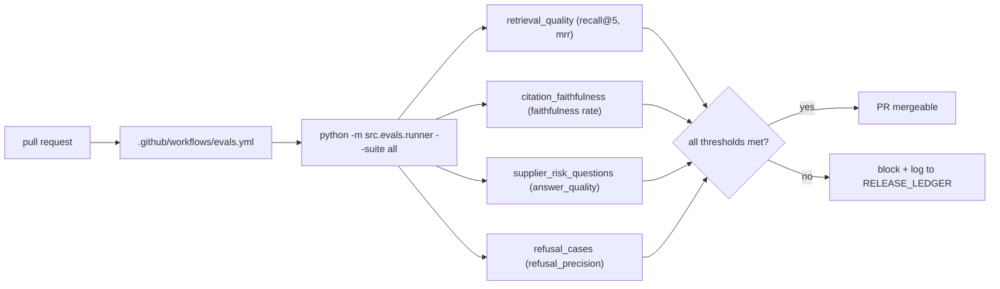
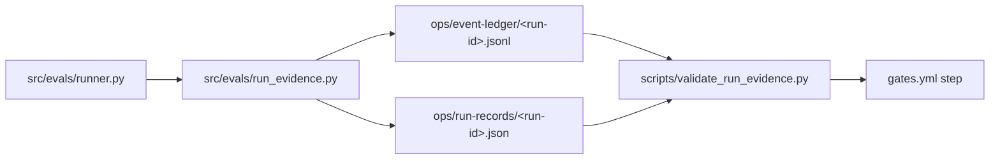
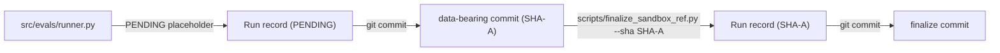

# design: evals-and-thresholds

## Shape

## Suite thresholds

| Suite | Metric | Threshold | Failure mode covered |
|---|---|---:|---|
| retrieval_quality | recall@5 | ≥ 0.70 | The right chunks fall out of the top-k. |
| citation_faithfulness | faithfulness | ≥ 0.95 | The cited span does not exist verbatim in any retrieved chunk. |
| supplier_risk_questions | answer_quality | (per-case required terms + expected accessions) | The end-to-end answer drops required terms or misses expected citations. |
| refusal_cases | refusal_precision | ≥ 0.85 | An out-of-scope or unsupported query gets paraphrased instead of refused. |

## Modules

### `eval_suites/*.yaml`

Four YAML case sets. Each case carries an id, a query, and the
suite-specific expectations (`expected_accessions`,
`required_terms`, or `expected_refusal`).

### `src/evals/runner.py`

Walks the suites, computes the per-suite metrics, prints a summary,
and supports `--json` for experiment ablation runs and `--report`
for the local HTML report.

### `.github/workflows/evals.yml`

Runs the runner on push and PR. The job uses no real API keys; the
suites run on the in-memory sample corpus with deterministic local
retrieval and verification.

## Failure modes

- A prompt change shifts answers so a citation no longer appears
  verbatim in a retrieved chunk: `citation_faithfulness` fails the
  gate.
- A retrieval-weight change drops a needed chunk below top-5:
  `retrieval_quality` fails.
- A refusal rule loosens and lets an out-of-scope query through:
  `refusal_cases` fails.
- A model-id change in `src/config.py` shifts answer wording in a
  way that drops required terms: `supplier_risk_questions` fails.

## Run-evidence emission layer (R-EVL-006..011)

Per suite execution the runner emits one Run record (conformant to
the amended `run.schema.json` with the six replay-equivalence
fields) plus a JSONL ledger of `pipeline.start`,
`tool.call.completed`, `gate.check.passed` or `gate.check.failed`,
and `gate.run.evidence_recorded` events. The validator gate enforces
schema conformance on every CI run.

`prompt_snapshot_hash` and `tool_schemas_snapshot_hash` are always
populated. `sandbox_image_ref` is populated from the repo HEAD.
`gate_results_summary` is aggregated from the fired `gate.check.*`
events. `determinism` is populated only when the suite YAML carries
an explicit block. `checkpoint_ref` is omitted because the eval
runner runs in-process with no managed-task checkpoint store.

## Round-3 cross-checks (R-EVL-012..015)

The validator extends schema conformance with four cross-checks that
tie the Run record to its event ledger:

| # | Cross-check | Validator message on failure |
|---|---|---|
| 1 | `Run.prompt_snapshot_hash == pipeline.start.payload.prompt_snapshot_hash` | `prompt_snapshot_hash mismatch (Run=... != pipeline.start=...)` |
| 2 | `Run.tool_schemas_snapshot_hash == pipeline.start.payload.tool_schemas_snapshot_hash` | `tool_schemas_snapshot_hash mismatch (Run=... != pipeline.start=...)` |
| 3 | `gate.run.evidence_recorded.payload.fields_populated == sorted set of replay fields populated on Run` | `gate.run.evidence_recorded fields_populated [...] does not match replay-equivalence fields populated on Run [...]` |
| 4 | `Run.gate_results_summary == aggregate(gate.check.* events in ledger)` | `gate_results_summary mismatch (Run=... != events=...)` |

A Run whose `status == "done"` must also populate the four
required-for-done fields (`prompt_snapshot_hash`,
`tool_schemas_snapshot_hash`, `sandbox_image_ref`,
`gate_results_summary`) and must have at least one terminal
`gate.run.evidence_recorded` event in its ledger. Each rule yields a
distinct validator message so a CI failure points one-to-one at the
broken discipline rule.

The runner emits a `pipeline.done` event before
`gate.run.evidence_recorded` so a downstream consumer that scans on
the typed `pipeline.done` payload finds the gate rollup without
walking the Run record.

## Round-6 portable-URI migration (R-EVL-020..023)

The eval-suite emitter produces refs in the portable
`repo://<repo>@<sha>/<rel-path>` grammar defined in athena-site
DEC-CDCP-014 instead of the producer's local absolute path. The
grammar pins three Run-record fields:

| Field | Shape | Notes |
|---|---|---|
| `sandbox_image_ref` | `repo://supplier-risk-rag-agent@<sha>/` | Empty path after the slash. SHA may be a 40-char hex or the `PENDING` sentinel before finalize. |
| `inputs[].ref` | `repo://supplier-risk-rag-agent@<sha>/<rel-path>` | `<rel-path>` is the path inside the repo (forward slashes). |
| `workspace_id` | `supplier-risk-rag-agent` | Identity token, not a file ref. No scheme prefix, no SHA. |

`scripts/validate_run_evidence.py` and `scripts/replay_run.py`
each ship a `resolve_uri(uri, portfolio_root)` helper per the
consumer-side rule from DEC-CDCP-014. The helper maps a `repo://`
URI to `<portfolio_root>/<repo>/<rel-path>`, returns None for an
`artifact://` URI, and passes a legacy local path through
unchanged. Both consumers continue to accept the legacy
`<abs-path>@<sha>` form during the migration round.

### sandbox_image_ref off-by-one fix (Option A: two-pass emit)

The single-pass emitter called `git rev-parse HEAD` at emit-time
and recorded the parent of the commit that physically writes
the sample to disk. Round 6 closes the off-by-one with a
two-pass pattern:

Step 1 emits PENDING. Step 2 commits the data files. Step 3
runs `finalize_sandbox_ref.py` with the SHA of the data-bearing
commit. Step 4 commits the rewritten JSON.

Replay's HEAD-strict pre-flight treats the PENDING placeholder
as "current HEAD is the implicit pin" so a freshly regenerated
sample (still carrying PENDING) stays verifiable without an
intervening finalize step. Once finalize lands a real SHA the
strict equality branch fires as before, naming the recorded SHA
and the current HEAD in the divergence message.
