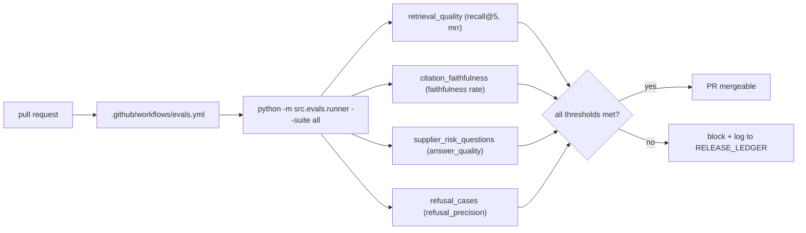

# design: evals-and-thresholds

## Shape

## Suite thresholds

| Suite | Metric | Threshold | Failure mode covered |
|---|---|---:|---|
| retrieval_quality | recall@5 | ≥ 0.70 | The right chunks fall out of the top-k. |
| citation_faithfulness | faithfulness | ≥ 0.95 | The cited span does not exist verbatim in any retrieved chunk. |
| supplier_risk_questions | answer_quality | (per-case required terms + expected accessions) | The end-to-end answer drops required terms or misses expected citations. |
| refusal_cases | refusal_precision | ≥ 0.85 | An out-of-scope or unsupported query gets paraphrased instead of refused. |

## Modules

### `eval_suites/*.yaml`

Four YAML case sets. Each case carries an id, a query, and the
suite-specific expectations (`expected_accessions`,
`required_terms`, or `expected_refusal`).

### `src/evals/runner.py`

Walks the suites, computes the per-suite metrics, prints a summary,
and supports `--json` for experiment ablation runs and `--report`
for the local HTML report.

### `.github/workflows/evals.yml`

Runs the runner on push and PR. The job uses no real API keys; the
suites run on the in-memory sample corpus with deterministic local
retrieval and verification.

## Failure modes

- A prompt change shifts answers so a citation no longer appears
  verbatim in a retrieved chunk: `citation_faithfulness` fails the
  gate.
- A retrieval-weight change drops a needed chunk below top-5:
  `retrieval_quality` fails.
- A refusal rule loosens and lets an out-of-scope query through:
  `refusal_cases` fails.
- A model-id change in `src/config.py` shifts answer wording in a
  way that drops required terms: `supplier_risk_questions` fails.
