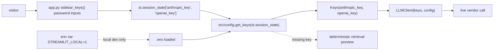

# design: deploy-and-secrets

## Shape

## Modules

### `app.py`

The Streamlit entrypoint. `sidebar_keys()` writes the user-supplied
keys to `st.session_state`. `render_answer` reads `Keys` via
`get_keys`, catches `MissingKeyError`, and falls back to the local
cited answer. The module never reads `st.secrets` and never sets env
vars from user input.

### `src/config.py`

Defines `Keys`, `ModelConfig`, `MissingKeyError`, `get_keys`, and
`get_model_config`. Reads `.env` only when `STREAMLIT_LOCAL=1` is
set. Accepts `st.session_state` as a key source for the BYOK flow.

### `docs/trust_model.md`

Documents the four trust properties: BYOK guarantee, local
environment fallback, logging and telemetry, and CI behavior.

### `.env.example`, `.gitignore`

`.env.example` shows the supported env var names; `.env` and
`.streamlit/secrets.toml` are gitignored.

## Failure modes

- A visitor never pastes a key and asks a question: `get_keys`
  raises `MissingKeyError`; `render_answer` falls back to the
  deterministic retrieval preview and tells the user.
- A pasted credential turns out to be invalid: the live SDK call
  raises; `render_answer` catches the exception and falls back to
  the local cited answer.
- A developer forgets to set `STREAMLIT_LOCAL=1` locally: the
  Streamlit app prompts for keys in the sidebar like a visitor.
  This is by design; the deploy path and the local path use the same
  BYOK code.
- A future operator adds `st.secrets`: caught by the documented rule
  in `docs/trust_model.md` and by the absence of a
  `.streamlit/secrets.toml` in the repo.
