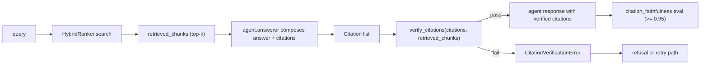

# design: citation-faithfulness

## Shape

## Modules

### `src/retrieval/citations.py`

Defines `Citation`, `CitationVerificationError`,
`citation_from_chunk`, `_to_chunk`, and `verify_citations`. The
verifier is a pure function: it takes citations and chunks and
returns the verified citations or raises.

### `src/agent/answerer.py`

Calls `verify_citations` after composing an answer. A verification
failure means the answer cannot ship; the answerer treats it as a
refusal trigger.

### `eval_suites/citation_faithfulness.yaml` + `src/evals/runner.py`

The eval suite runs 15 queries and computes the fraction of
answered cases where every cited span verifies. The threshold is
0.95 (one failure out of 15 is the absolute floor; two failures
fail the gate).

## Failure modes

- The LLM produces a paraphrased citation that does not appear
  verbatim in any retrieved chunk: `verify_citations` raises;
  faithfulness drops; the eval gate catches it.
- The LLM cites a chunk id that was not in `retrieved_chunks`
  (hallucinated source): `verify_citations` raises with "points to
  a chunk that was not retrieved."
- The cited span offsets are out of bounds: `verify_citations`
  raises with "invalid offsets."
- The reranker reorders results and the answerer picks a span from
  a chunk no longer in the top-k: this was the failure mode the
  cross-encoder experiment hit (faithfulness 1.000 -> 0.933).
