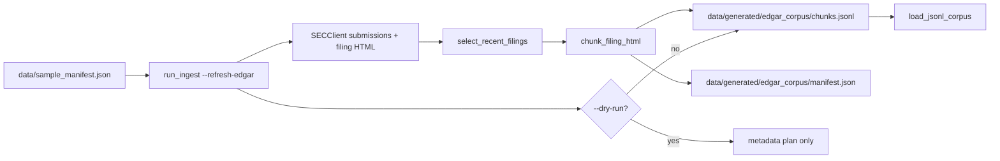

# design: EDGAR refresh

## Shape

## Modules

### `src/ingest/edgar_refresh.py`

Defines the testable refresh seam. The module accepts an
`EdgarClient` protocol, selects recent target filings from SEC
submissions JSON, chunks filing HTML, writes an atomic JSONL corpus,
and writes a refresh manifest.

### `src/ingest/run_ingest.py`

Owns CLI parsing and operator feedback. `--full-fetch` remains a
backward-compatible alias for `--refresh-edgar`; the production path is
named `--refresh-edgar`.

### `.github/workflows/edgar-refresh.yml`

Runs monthly and by manual dispatch. The job requires `SEC_USER_AGENT`,
uses a conservative request cap, and uploads generated corpus files as
workflow artifacts. It does not push generated corpus data back to the
repo.

## Failure modes

- Missing SEC contact: the GitHub workflow fails before making requests
  and tells the operator to configure `SEC_USER_AGENT`.
- SEC throttling or block: `SECClient` raises a targeted error for 403
  and 429 responses. Operators can lower `--requests-per-second`.
- Partial generated output: chunk and manifest writes use temp files
  followed by replace, so a failed run does not leave a half-written
  target file.
- Demo drift: Streamlit still loads `data/sample_corpus/` by default;
  generated EDGAR corpora are opt-in artifacts.
